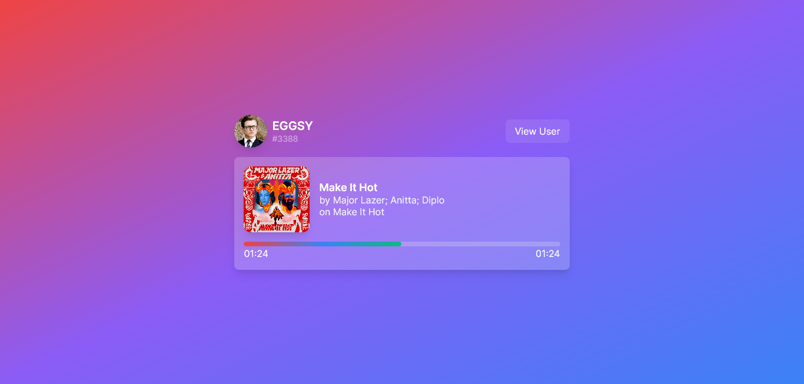

# ⚡ Lanyard Visualizer

  

A service to see your Discord status online easy and for free with the help of the [Lanyard API](https://github.com/phineas/lanyard)! **To use this service, you have to be in Lanyard's Discord server so that it could monitor you, you can find the invite link in [Lanyard's GitHub repository](https://github.com/phineas/lanyard).**

### 🔥 Features

- Spotify integration
  - It will display what you're listening, it'll show a progress bar just like the one on your Discord profile!
- Every RPCs work!
  - If there's something visible on your status (only RPCs), it's visible here too!
- Customization, use it as iframe, remove footer or title bar!
  - You can use simple queries like `?mode=iframe&title=false&footer=false` to customize the look of it! This way, you can iframe it to your website and remove the parts that you don't need!
- Everything is real-time!
  - We use Lanyard's WebSocket so everything is updated in real-time!

### ❓ How to use?

Just visit [this page](https://lanyard-visualizer.netlify.app) and use the input to check on whoever you want! _Keep in mind that the user has to be in Lanyard's Discord server so that they could be monitored by the service._

### 🌟 Host it yourself!

I don't collect any kind of data, there's no third-party plugins (except the Google Fonts), no cookies, nothing! If you still don't want to use the service, you can download from the source and host it yourself.

- Clone this repo: `git clone https://github.com/eggsy/lanyard-visualizer`
  - Change directory to the new folder: `cd lanyard-visualizer`
- Instal dependencies
  - With `npm`: `npm install`
  - With `yarn`: `yarn`
- Start in development, or build the app
  - With `npm`: `npm run dev` or `npm run build` (and then `npm run serve`)
  - With `yarn`: `yarn dev` or `yarn build` (and then `yarn serve`)

Starting in development mode will provide hot reloading, PRs and issues are always welcome! Feel free to contribute to my project.

### 🙏 Thanks

These are the technologies I used to create this website! This was my first time trying out Vue 3 (together with TypeScript, Vite, VueUse and Windi CSS) for an actual project and I'm obsessed with it now!

- [Lanyard API](https://github.com/phineas/lanyard) by [@phineas](https://github.com/phineas)
- [Vue 3](https://vuejs.org) by [@yyx990803](https://github.com/yyx990803)
- [Windi CSS](https://windicss.org)
- [VueUse](https://vueuse.org/)
